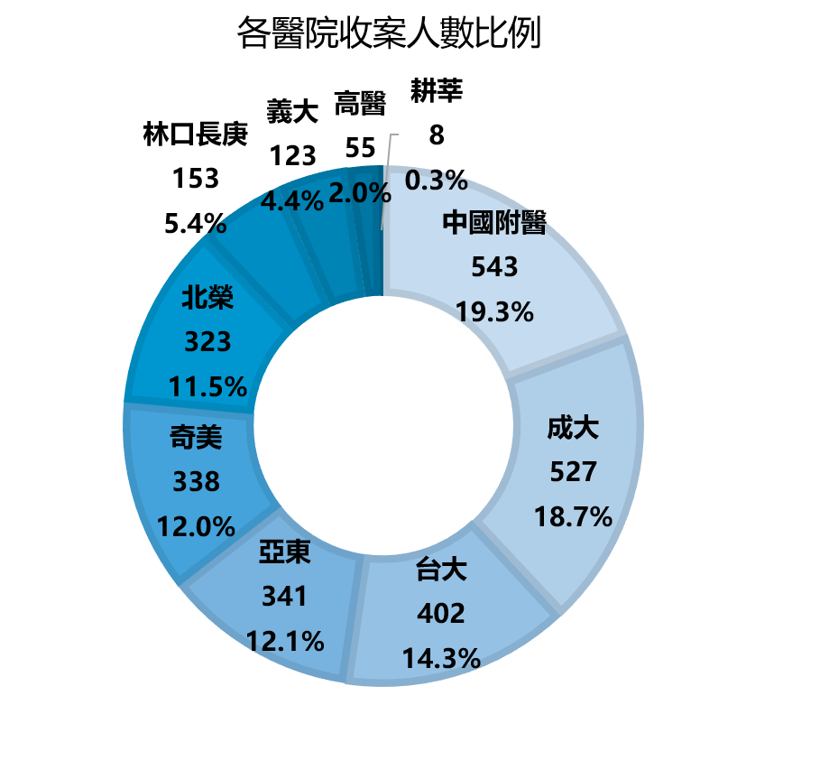

<link rel="stylesheet" href="/github_img/myCSS.css">

# Machine learning classification models for nocturnal dipping of blood pressure

## Abstract
  In recent years, home blood pressure monitoring (HBPM) is the most recommended
monitoring method for blood pressure tracking in Taiwan's hypertension treatment guidelines.
Still, this method has the disadvantage of monitoring blood pressure during nighttime sleep.
However, an irregular nocturnal dipping rate would increase the risk of cardiovascular events
and death.

  Therefore, this study uses the Taiwan Consortium of Hypertension associated
Cardiac Disease (TCHCD) database and <b>uses machine learning methods to predict nocturnal
dipping status with home blood pressure and other variables and provide model
recommendations analysis strategies to assist clinical physicians in early assess the patient's
condition.</b>

  This study predicted the model from three different perspectives: <b>multi-wave repeated
measures, single-wave repeated measures, and cross-sectional data. Uses Binary mixed model
forest (BiMM Forest) series models, random forest, Logistic Regression, and XGBoost model
to compare and select the most suitable model under different data forms.</b> In terms of the
confounding effects, we implemented the analysis with and without covariates.

  At the end of the study, we found out that for the TCHCD database, the performance of
the included covariates was better than that of the non-included covariates in all cases, and the
repeated measures data also performed better than the cross-section data. According to the
data, the best prediction ability is the case of multi-wave repeated measures, and the inclusion
of covariates in Visit1 predicts Visit2. We were using one iteration of the BiMM Forest series
model, <b>with 81.7% of accuracy</b>, indicates that home blood pressure and other variables can
predict. Predict nocturnal blood pressure drop.

<b>Keywords: Nocturnal dipping、Machine learning、Repeated measure、Random Forest、Binary Mixed Model Forest</b>

<!--## Data Sets

   
  
 
  

-->

## Work Flow

    There are many datasets in TCHCD database including Demographics, Blood pressure measurements, Vital Signs, Treatment, etc. 
  And the Blood pressure measurements,Vital Signs, Treatment datasets were repeated measures every few months.
  
  Data preprocessing including :
  
<b>1.Data cleaning</b> 
  For each dataset, we delete duplicate data or all data with missing value. 
  For demographics, we delete material with unreasonable birthday, date of visit, or missing value. 
  And for repeated measures datasets, we renumber the variable “visit” according to the time sequence.

<b>2.Data merge</b> 
  After cleaning the data, we merged all datasets into one big dataset and it including all variables in database.

<b>3.Variable selecting</b> 
  Trying to figure out what variables are more important in this research, after excluding variables that missing values are more than 30%, we use Random Forest to   cauclate the variable importance. 
  And depends on missing pattern, different predict rule would select different variables.

<b>4.Data imputation</b> 
  We use "missForest" method to impute missing values in dataset, and made the dataset more complete in order to modeling and analyzing the data.

<b>5.Data Split</b> 
  According to the predict rules in the flow charts, we split data into Training Set and Test Set. 
  When the predict rule is "Visit 1 predict new patients", we include all people in Visit 1. 
  And when it comes to "Visit 1 predict Visit 2" or "Visit 1 & 2 predict Visit 3", we only include those who have all 3 visits.

   

